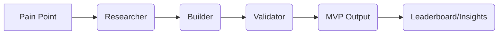

Perfect 🔥 — below is a **ready-to-drop file** for your repo:

---

## 📄 `docs/PHASE33_BUILD_PLAN.md`

````markdown
# 🚀 Phase 33 – “Pain Point → MVP Studio”

## 🎯 Objective
Turn Realwebwins from an internal analytics tool into a **public, interactive builder** where users:
1. 🔍 Search real pain points  
2. 🤖 Watch AI agents (Researcher → Builder → Validator) collaborate live  
3. 🧩 Receive an MVP blueprint + validation report  
4. 📦 Download or share the result

Everything happens inside a dark-neon, one-page experience.

---

## 🧠 System Recap (Phases 1-32)

- Supabase schema ✅ (`research_projects`, `agent_reflections`, `agent_metrics`, `agent_links`, `agent_leaderboard`, `agent_insights`, `user_profiles`, `user_credits`)
- Working APIs ✅ (`/api/agents/*`, `/api/auth/session`, `/api/cron/*`)
- Internal dashboard ✅ (analytics + leaderboard + health + weekly)
- Verified agents ✅ (Researcher, Validator, Builder, Collaborator, Metrics, Leaderboard, Health)
- Auth + credit logic ✅ (`/api/auth/session`, credit deduction)

---

## 🧩 New Components (Phase 33)

### 1️⃣ Database — Migrations
Create `scripts/migrations/create_phase33_pain_mvp_tables.sql`

```sql
-- pain points searchable by visitors
CREATE TABLE IF NOT EXISTS public.pain_points (
  id uuid PRIMARY KEY DEFAULT gen_random_uuid(),
  summary text NOT NULL,
  category text,
  popularity_score numeric DEFAULT 0,
  proof_links jsonb DEFAULT '[]'::jsonb,
  created_at timestamptz DEFAULT now()
);

-- multi-agent chat sessions per pain point
CREATE TABLE IF NOT EXISTS public.agent_sessions (
  id uuid PRIMARY KEY DEFAULT gen_random_uuid(),
  pain_id uuid REFERENCES public.pain_points(id) ON DELETE CASCADE,
  started_by uuid REFERENCES public.user_profiles(id),
  status text DEFAULT 'running',
  transcript jsonb DEFAULT '[]'::jsonb,
  created_at timestamptz DEFAULT now(),
  completed_at timestamptz
);

-- final MVP result of a session
CREATE TABLE IF NOT EXISTS public.mvp_outputs (
  id uuid PRIMARY KEY DEFAULT gen_random_uuid(),
  session_id uuid REFERENCES public.agent_sessions(id) ON DELETE CASCADE,
  title text,
  summary text,
  stack text,
  pricing text,
  risk text,
  validation_score numeric,
  download_urls jsonb DEFAULT '{}'::jsonb,
  created_at timestamptz DEFAULT now()
);

NOTIFY pgrst, 'reload schema';
````

Add script alias:

```json
"ensure:phase33-schema": "node --env-file .env.local scripts/runMigration.mjs scripts/migrations/create_phase33_pain_mvp_tables.sql"
```

---

### 2️⃣ Backend APIs

| Route                      | Method   | Description                                                    |
| -------------------------- | -------- | -------------------------------------------------------------- |
| `/api/painpoints`          | **GET**  | list / search pain points (`?q=etsy`)                          |
| `/api/painpoints`          | **POST** | add new pain point (admin / service role)                      |
| `/api/mvp/generate`        | **POST** | orchestrate Researcher → Builder → Validator chain for pain_id |
| `/api/agents/session/[id]` | **GET**  | poll or stream transcript (JSON)                               |
| `/api/agents/interrupt`    | **POST** | inject user feedback during run                                |
| `/api/export/mvp/[id]`     | **GET**  | return ZIP (MVP.md + validation.pdf + conversation.json)       |

#### Example `/api/mvp/generate` flow

1. Fetch pain point
2. Spawn agent session → insert `agent_sessions`
3. Call `/api/agents/collaborate` with context {pain_id, agents:[researcher,builder,validator]}
4. Stream reflections → append to `transcript`
5. Summarize + insert `mvp_outputs`
6. Return `{session_id, mvp_id, output}`

---

### 3️⃣ Frontend (Next.js 15 + Tailwind + Shadcn + Framer Motion)

#### Routes & Views

| Page           | Purpose                                      |
| -------------- | -------------------------------------------- |
| `/discover`    | Public search + browse pain points           |
| `/pain/[id]`   | Live Agent Studio (chat + generation)        |
| `/mvp/[slug]`  | Result page with MVP blueprint and downloads |
| `/dashboard/*` | Existing private views (unchanged)           |

#### Shared components

```
/src/components/
  layout/AppShell.tsx
  painpoint/SearchBar.tsx
  painpoint/PainCard.tsx
  agents/ChatPanel.tsx
  agents/AgentBubble.tsx
  mvp/MVPCard.tsx
  mvp/DownloadModal.tsx
```

---

### 4️⃣ UI Behavior / UX Flow

1. **Search Pain Points**

   * Input + filter chips
   * Cards show summary + category + “Run Agents ▶”
   * `GET /api/painpoints?q=...`

2. **Run Agents → Live Studio**

   * Animated chat bubbles
   * Agents: 👩‍💼 Researcher, 🧑‍💻 Builder, 🧠 Validator
   * Show typing indicator + colored glow
   * Poll `/api/agents/session/[id]` until `status='done'`

3. **MVP Reveal**

   * Card with fields: Title | Type | Stack | Pricing | Risk | Score
   * Buttons: [Download Pack] [Share Link] [Remix Pain ▶]

4. **Download Pack**

   * `/api/export/mvp/[id]` → zip(MVP.md, validation.pdf, conversation.json)

5. **Share Flow**

   * Modal → copy link + social share
   * Optional: credits deducted per run

---

### 5️⃣ Agent Logic Pipeline



| Agent           | Action                                          |
| --------------- | ----------------------------------------------- |
| **Researcher**  | expands context + competitive landscape         |
| **Builder**     | drafts MVP plan (stack, pricing, time to build) |
| **Validator**   | scores idea and summarizes risks                |
| **Metrics**     | updates impact/consistency in `agent_metrics`   |
| **Leaderboard** | refreshes global rankings & insights            |

---

### 6️⃣ Interactive Chat Mechanics

| Feature                | Implementation                                                |
| ---------------------- | ------------------------------------------------------------- |
| Typing indicator       | client-side `isTyping` + polling or SSE                       |
| Agent avatars + colors | teal = Researcher, violet = Builder, gold = Validator         |
| User feedback          | POST `/api/agents/interrupt` → rerun chain                    |
| Editable bubbles       | contentEditable + PATCH reflection                            |
| Animation              | Framer Motion fade/slide in; glowing edges on message arrival |

---

### 7️⃣ Export / Download System

Use existing export pipeline in `scripts/export/*`.

```bash
export/mvp/[id]
├── MVP.md
├── validation.pdf
└── conversation.json
```

`MVP.md` = human-readable summary.
`validation.pdf` = formatted report using reportlab.
`conversation.json` = raw agent session transcript.

---

### 8️⃣ Verification Scripts (Phase 33)

`scripts/test/verifyPainPointMVP.mjs`

```js
/**
 * 1. Check pain_points table
 * 2. POST /api/mvp/generate {pain_id}
 * 3. Poll /api/agents/session/[id] until done
 * 4. Confirm mvp_outputs entry + transcript saved
 */
```

Expected output:

```
🚀 Phase 33 Pain → MVP Verification
✓ Pain points table exists
✓ MVP generated for sample pain
✓ Transcript saved (3 agents)
✓ MVP pack exported successfully
✅ Verification completed
```

---

### 9️⃣ Analytics / Logging

* Store session duration, agent count, validation score, downloads.
* Add `event_logs` table for future tracking.

---

### 🔟 Design & Theme

Dark neon gradient #0F1117→#161A23
Accents #00FFE0 (teal), #6366F1 (violet), #FFB300 (gold)
Typography Inter / Geist Sans
Cards = glassmorphism + soft shadow + hover glow
Framer Motion transitions (0.3 s ease-out)

---

## 🧭 Development Order (Suggested for VS Code)

1. **Run migration**

   ```bash
   npm run ensure:phase33-schema
   ```
2. **Implement APIs**

   * `/api/painpoints`
   * `/api/mvp/generate`
   * `/api/agents/session/[id]`
3. **Frontend pages**

   * `/discover`
   * `/pain/[id]`
   * `/mvp/[slug]`
4. **Hook chat UI → API**
5. **Integrate download/export**
6. **Run verifyPainPointMVP.mjs**
7. **Commit + tag**

   ```bash
   git add .
   git commit -m "Phase 33 – Pain Point → MVP Studio initial"
   git tag -a phase33-start -m "Phase 33 build begun"
   git push --follow-tags
   ```

---

### ✅ Deliverables End of Phase 33

| Component           | Description                                | Status |
| ------------------- | ------------------------------------------ | ------ |
| Database migrations | pain_points / agent_sessions / mvp_outputs | 🟢 New |
| APIs                | painpoints, mvp/generate, agents/session   | 🟢 New |
| Frontend            | discover / pain / mvp pages + chat UI      | 🟢 New |
| Exports             | MVP pack (md/pdf/json)                     | 🟢 New |
| Dashboard           | unchanged (still available to admin)       | 🟡     |
| Verification script | verifyPainPointMVP.mjs                     | 🟢     |
| Tag                 | phase33-complete                           | 🔜     |

---

### 🧩 Vision Beyond Phase 33

Once this hub works:

* Add credit deductions per MVP generation.
* Public leaderboard of top pain points + most remixed MVPs.
* Email “Weekly Pain Point Trends” summary (Phase 34).
* Paid tiers / Stripe checkout later.

---

## 🧠 Final Notes for Developers

* Keep migrations idempotent (`IF NOT EXISTS` + NOTIFY).
* Use existing agent lib patterns (`/src/lib/agents/*`).
* All fetches server-side SSR compatible (`@supabase/ssr`).
* For streaming, prefer SSE or interval poll → replace later with websocket.
* Follow naming convention: `phase33_*.sql`, `verifyPainPointMVP.mjs`.

> *End of Phase 33 Build Plan — ready for implementation in VS Code.*

```
-