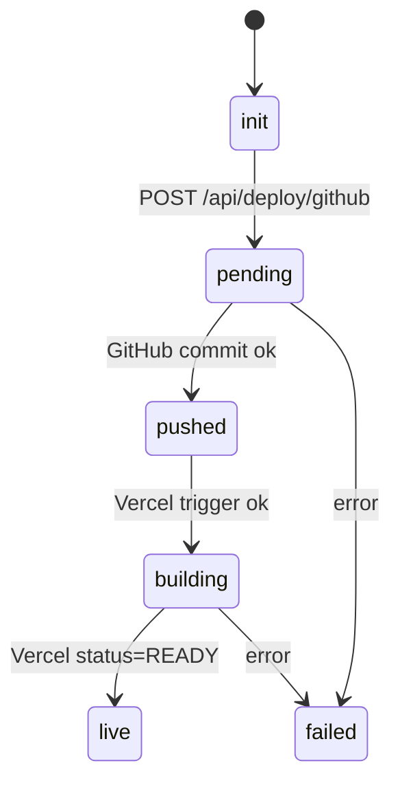

# RealWebWins 2.0 — Phases 40 & 41 (Full Expanded Engineering Spec)
**Version:** 1.0  
**Generated:** 2025-10-27T12:28:32.544943Z

**Applies to:** Next.js App Router · TypeScript · Supabase · Drizzle/SQL · Tailwind · Zustand · SSE · OpenAI/Anthropic/Gemini (via runLLM)

---

## Executive Summary

**Phase 40 — Deliverables Preview & Web Viewer**
- Goal: Let users **browse all generated artifacts in-browser** (code, docs, diagrams) with rich previews, diff view, search-in-files, and gated downloads.
- Outputs: `/mvp/[id]/preview` web viewer, file tree, rendered Markdown/HTML previews, syntax highlighting, artifact search, tier locks, telemetry.

**Phase 41 — One‑Click Deploy (GitHub + Vercel)**
- Goal: Users with Pro/Premium tiers can **push a repo to GitHub** and optionally **trigger a Vercel deploy** from within RealWebWins.
- Outputs: OAuth flows, server routes to assemble repo tree, commit & push via Octokit, Vercel deploy hook, status polling, UI feedback & audit trail.

This spec includes detailed schemas, API contracts, UI component structure, state machines, validation, telemetry, test plans, and rollout steps. It assumes Phase 38 is live (artifacts + tier metadata + export view tracking).

---

## Architecture Overview

```
Browser (Next.js App)
   ├─ /mvp/[id]/preview (Phase 40)
   │   ├─ FileTree (artifact/project files)
   │   ├─ PreviewPane (markdown/html/code/pdf)
   │   ├─ InfoPanel (meta, tier, validation)
   │   └─ ActionsBar (download, copy, deploy)
   └─ /mvp/[id]/deploy (Phase 41)
       ├─ ProviderConnect (GitHub/Vercel OAuth)
       ├─ RepoDetails (name, private, readme)
       └─ DeployStatus (commit → build → live)
            ↑
Next.js API Routes
   ├─ GET /api/mvp/[id]/deliverables (Phase 38 base)
   ├─ GET /api/mvp/[id]/project (Phase 40)
   ├─ POST /api/mvp/[id]/export (zip/pdf/web) (Phase 37/40)
   ├─ POST /api/deploy/github (Phase 41)
   ├─ GET  /api/deploy/status   (Phase 41)
   └─ POST /api/deploy/vercel   (Phase 41)
            ↑
Server Lib
   ├─ lib/mvp/artifacts.ts (Phase 38+)
   ├─ lib/templates/injector.ts (Phase 37+)
   ├─ lib/export/{zip,pdf,web}.ts (Phase 37+)
   ├─ lib/integrations/github.ts (Phase 41)
   └─ lib/integrations/vercel.ts (Phase 41)
            ↑
Supabase (DB) + Storage
   ├─ mvp_outputs, mvp_artifacts, mvp_exports
   ├─ auth (users, tokens), system_settings
   └─ audit tables (deploys, oauth_links)
```

---

## Data Model (DB) — Additions for Phases 40 & 41

> Pre-req: Phase 38 already created `preview_html`, `tier` in `mvp_artifacts` and `viewed_at` in `mvp_exports`.

### 1) Project Snapshot (optional optimization)
If you want to persist a **normalized, merged view** of the final file tree for quick web previews.

```sql
-- scripts/migrations/create_phase40_project_snapshot.sql
CREATE TABLE IF NOT EXISTS public.mvp_project_snapshots (
  id uuid PRIMARY KEY DEFAULT gen_random_uuid(),
  mvp_id uuid NOT NULL REFERENCES public.mvp_outputs(id) ON DELETE CASCADE,
  files jsonb NOT NULL DEFAULT '{{}}'::jsonb,   -- {{ "path/to/file.tsx": {{ "content": "...", "mime": "text/tsx" }}, ... }}
  created_at timestamptz DEFAULT now()
);

CREATE UNIQUE INDEX IF NOT EXISTS mvp_project_snapshots_mvp_id_uniq
  ON public.mvp_project_snapshots(mvp_id);
```

**When to write:** After artifacts validate & template injection completes, write final file map here for fast Phase 40 previews.

### 2) Deploy Audit (Phase 41)
Track GitHub/Vercel actions and statuses.

```sql
-- scripts/migrations/create_phase41_deploy_audit.sql
CREATE TABLE IF NOT EXISTS public.mvp_deploys (
  id uuid PRIMARY KEY DEFAULT gen_random_uuid(),
  mvp_id uuid NOT NULL REFERENCES public.mvp_outputs(id) ON DELETE CASCADE,
  user_id uuid,
  provider text NOT NULL,      -- 'github' | 'vercel'
  status text NOT NULL,        -- 'init' | 'pending' | 'pushed' | 'building' | 'live' | 'failed'
  repo_url text,
  deploy_url text,
  error text,
  metadata jsonb DEFAULT '{{}}'::jsonb,
  created_at timestamptz DEFAULT now(),
  updated_at timestamptz DEFAULT now()
);

CREATE INDEX IF NOT EXISTS mvp_deploys_mvp_id_idx ON public.mvp_deploys(mvp_id);
```

---

## API Design

### GET `/api/mvp/[id]/project`  (Phase 40)
Return a **web‑previewable project tree**: either from `mvp_project_snapshots.files` or composed on-the-fly from `project_files` + `artifacts`.

**Response (200):**
```json
{{
  "success": true,
  "mvp_id": "uuid",
  "tier": "free|pro|premium|core",
  "files": {{
    "README.md": {{ "mime": "text/markdown", "size": 1234, "tier": "free" }},
    "src/app/page.tsx": {{ "mime": "text/tsx", "size": 3456, "tier": "pro" }},
    "public/diagram.svg": {{ "mime": "image/svg+xml", "size": 789, "tier": "free" }}
  }},
  "meta": {{
    "artifact_count": 7,
    "validated": true,
    "validation_summary": "2 warnings, 0 errors"
  }}
}}
```

**Notes:**
- Attach `tier` per file where relevant (gating in UI).
- If snapshot missing, generate `files` by merging template + injected artifacts server-side and return (do not persist unless configured).

---

### POST `/api/mvp/[id]/export` (Phase 40 extension)
Accept `{{ "format": "zip"|"pdf"|"web", "tier": "free"|"pro"|"premium" }}` then stream or return a signed download URL. Also **insert into `mvp_exports`** with metadata and tier.

**Errors:**
- `403` when requested tier > user tier (use `tierGate`).
- `409` if export in progress & concurrency lock set (optional).

---

### POST `/api/deploy/github`  (Phase 41)
Push project files to a **new GitHub repo** for the authenticated user.

**Payload:**
```json
{{
  "mvp_id": "uuid",
  "repo_name": "realwebwins-mvp-123",
  "private": true,
  "readme": true,
  "vercel": {{ "trigger": true, "projectName": "realwebwins-mvp-123" }}
}}
```

**Response (200):**
```json
{{
  "success": true,
  "deploy_id": "uuid",
  "repo_url": "https://github.com/you/realwebwins-mvp-123",
  "vercel_triggered": true
}}
```

**Behavior:**
- Requires **GitHub OAuth** (store/access user token).
- Creates `mvp_deploys` row with `status='pending'` → updates to `pushed` once commit succeeds.
- If `vercel.trigger=true`, call Vercel hook (see below) and update `deploy_url` + `status='building'`.

---

### GET `/api/deploy/status?deploy_id=...` (Phase 41)
Return latest deploy status from DB, optionally refresh from provider.

```json
{{
  "success": true,
  "deploy": {{
    "status": "live",
    "repo_url": "...",
    "deploy_url": "https://your-app.vercel.app",
    "updated_at": "2025-10-27T12:34:56Z",
    "metadata": {{ "github_commit_sha": "...", "vercel_build_id": "..." }}
  }}
}}
```

---

### POST `/api/deploy/vercel` (Phase 41)
Optional direct trigger endpoint (service key) if not chaining from `/api/deploy/github`. Supply repo slug and settings, return deploy URL or ID.

---

## Server Libraries (Implementation Details)

### 1) `src/lib/integrations/github.ts`
- `ensureGitHubToken(userId)`: fetch user’s GitHub OAuth token (Supabase auth or your table).
- `createRepo(octokit, {{ name, private, description }})`
- `pushTree(octokit, owner, repo, files: ProjectFiles)`  
  Build a git tree & commit using Octokit; support **binary files** (base64).
- `addVercelDeployBadge(files)`: inject README section with “Deploy to Vercel” button.

### 2) `src/lib/integrations/vercel.ts`
- `triggerDeploy({{ repoSlug, projectName }})`: POST to Vercel Deploy Hook (requires Vercel token).
- `getDeployStatus({{ projectId|buildId }})`: poll Vercel API (optional).

### 3) `src/lib/export/web.ts` (Phase 40)
- Transform `ProjectFiles` into a **minimal static viewer** bundle (if you want downloadable web preview).
- Or serve previews live via `/mvp/[id]/preview` without a bundle.

### 4) `src/lib/mvp/project.ts`
- `buildProjectForPreview(mvpId)`: return normalized `{{ files }}` map with MIME, size, tier.
- Prefer snapshot if exists; else synthesize from `project_files` + `artifacts`.

---

## Frontend UI (Next.js App)

### Routes
- `/mvp/[id]/preview` — **Phase 40 web viewer**
- `/mvp/[id]/deploy` — **Phase 41 deploy wizard**

### Components (Phase 40)
- `FileTree.tsx` — searchable tree, shows lock icon for gated files.
- `PreviewPane.tsx` — renderers: Markdown (remark), HTML sandbox (iframe), Code (monaco/light-highlighter), Images/SVG, Fallback text viewer.
- `InfoPanel.tsx` — validation status, artifact meta, tier badges.
- `ActionsBar.tsx` — **Download** (hits export API), **Copy**, **Open in Editor** (optional), **Deploy** (navigates Phase 41).
- `SearchInFiles.tsx` — client search across open file with debounce; optional server-side search.

**UX Notes:**
- If file `tier > userTier`, show blurred preview + **UpgradeModal**.
- Persist last-opened file per MVP in `localStorage`.
- Record view events: fire `/api/exports/[id]/viewed` when download completes.

### Components (Phase 41)
- `ProviderConnect.tsx` — shows GitHub/Vercel connect state (tokens present?).
- `RepoDetails.tsx` — name, visibility, README, license checkbox.
- `DeployButton.tsx` — calls `/api/deploy/github`, then starts polling `/api/deploy/status`.
- `DeployStatus.tsx` — state machine view: `init → pending → pushed → building → live | failed`.

**State Machine (client)**


---

## Security & Tier Gating

- Use existing `tierGate` on server routes (`export`, `project`, `deploy`).
- Client helpers: `assertTierAccess(userTier, required)`; UI shows **UpgradeModal**.
- OAuth scopes: GitHub (`repo`, `workflow` if needed). Never store raw tokens in localStorage; keep in server-side session or encrypted table.

---

## Validation & Telemetry

- Before preview/export/deploy:
  - Re-run **artifact validation** if `validation_status != 'validated'`.
  - Store validation report JSON in `mvp_artifacts.validation_errors` and summary in `mvp_outputs.metadata`.
- Telemetry:
  - `AgentStatus` / `system_settings` hooks already in place — extend with `event: 'preview_open'|'deploy_start'|'deploy_live'` and include `provider`, `duration_ms`, `file_count`.
- Errors:
  - Log structured JSON to server console and Supabase `mvp_deploys.error`.

---

## Testing Plan

### Unit (Node)
- `scripts/test/verifyProjectPreview.mjs`
  - Create sample MVP with artifacts → call `/api/mvp/[id]/project` → assert file map, tier flags, and validation meta.
- `scripts/test/verifyDeployFlow.mjs`
  - Mock Octokit (record mode) → POST `/api/deploy/github` → assert `mvp_deploys.status=pushed` → (optionally) mock Vercel and reach `live`.

### E2E (Optional Playwright)
- Load `/mvp/[id]/preview`: expands tree, renders markdown/code, locks premium file; download zip; open upgrade modal.
- Load `/mvp/[id]/deploy`: repo create flow; status polling to `live`; CTA to open repo/deploy.

---

## Rollout Steps

1. **Migrations**
   - Run `ensure:phase40-schema` (project snapshots) if you want snapshot perf.
   - Run `ensure:phase41-schema` (deploy audit).
2. **Secrets**
   - Add `GITHUB_CLIENT_ID`, `GITHUB_CLIENT_SECRET`, `VERCEL_API_TOKEN`, `VERCEL_DEPLOY_HOOK_URL`.
3. **Server**
   - Implement `/api/mvp/[id]/project`, `/api/deploy/*` routes.
4. **UI**
   - Add `/mvp/[id]/preview` and `/mvp/[id]/deploy` pages + components.
5. **QA**
   - Generate an MVP with artifacts → verify preview works → push to GitHub (test org) → trigger Vercel → confirm live URL.
6. **Docs**
   - Update README/ROADMAP; add “Deploy” guide and troubleshooting.

---

## Pseudocode & Contracts

### `/api/mvp/[id]/project` (simplified)
```ts
export async function GET(req, {{ params }}) {{
  const user = await requireUser(req);
  await requireTier('free', user);

  const mvp = await getMVPOutput(params.id);
  if (!mvp) return err(404, 'MVP_NOT_FOUND');

  const snapshot = await getSnapshot(mvp.id);
  const files = snapshot?.files ?? await buildProjectForPreview(mvp);

  // annotate per-file tier
  const annotated = annotateWithTier(files, mvp.deliverable_mode);

  return json({{ success: true, mvp_id: mvp.id, tier: user.tier, files: annotated, meta: summarize(files) }});
}}
```

### `/api/deploy/github`
```ts
export async function POST(req) {{
  const {{ mvp_id, repo_name, private: isPrivate, readme, vercel }} = await req.json();
  const user = await requireUser(req);
  await requireTier('pro', user);

  const files = await getFilesForDeploy(mvp_id); // validated, full project tree
  const octokit = await getOctokitForUser(user.id);
  const {{ repoUrl, commitSha }} = await pushToGitHub(octokit, {{ repo_name, private: isPrivate, files, readme }});

  const deploy = await createDeployAudit({{ mvp_id, user_id: user.id, provider: 'github', status: 'pushed', repo_url: repoUrl, metadata: {{ commitSha }} }});

  if (vercel?.trigger) {{
    const {{ deployUrl, buildId }} = await triggerVercel({{ repoSlug: repoUrl.split('github.com/')[1], projectName: vercel.projectName }});
    await updateDeployAudit(deploy.id, {{ status: 'building', deploy_url: deployUrl, metadata: {{ **prev**: deploy.metadata, buildId }} }});
  }}

  return json({{ success: true, deploy_id: deploy.id, repo_url: repoUrl, vercel_triggered: !!vercel?.trigger }});
}}
```

---

## UI Wireframes (ASCII)

**Preview**
```
+---------------------------------------------------------------+
| FileTree              | PreviewPane                 | Info    |
| - README.md           | [Markdown render]           | Valid ✓ |
| - src/                | --------------------------- | Tier:Pro|
|   - app/page.tsx      | Copy   Download   Deploy    | Art: 12 |
|   - lib/db/schema.ts  | --------------------------- | Warn: 1 |
| - public/diagram.svg  | [SVG render]                | ...     |
+---------------------------------------------------------------+
```

**Deploy**
```
+------------------ Deploy to GitHub / Vercel ------------------+
| Connect GitHub: [ Connected ]  Connect Vercel: [ Not Yet ]    |
| Repo Name: realwebwins-mvp-123   [private] [Add README]       |
| [ Deploy ]                                                ⏵   |
|                                                              |
| Status: pushed → building → live  (https://*.vercel.app)     |
+---------------------------------------------------------------+
```

---

## Edge Cases & Safeguards

- **Large projects:** chunk GitHub tree; limit file size; compress images.
- **Binary previews:** only allow safe types (png/jpg/svg/pdf). For others, download only.
- **Tier downgrade:** previously unlocked exports remain downloadable; new exports respect current tier.
- **Token expiry:** handle 401 from GitHub/Vercel, prompt re‑connect.

---

## Checklist (DoD — Definition of Done)

- [ ] Migrations applied; settings/env documented.
- [ ] `/api/mvp/[id]/project` returns file map w/ tier flags.
- [ ] `/mvp/[id]/preview` renders markdown/code/images; gates premium.
- [ ] `/api/deploy/github` creates repo & pushes tree; audit row recorded.
- [ ] `/api/deploy/status` updates to `live` after Vercel build.
- [ ] Telemetry events recorded; errors surfaced in Admin analytics.
- [ ] Playbook updated: troubleshooting, rate limits, quotas.
- [ ] Two successful end‑to‑end runs (demo repos + live Vercel).

---

## Appendix

### MIME & Renderer Map
- `.md` → Markdown renderer
- `.html` → sandbox Iframe (sanitize)
- `.ts/.tsx/.js/.css` → code viewer (monaco/highlighter)
- `.json/.yml/.yaml` → structured viewer
- `.svg/.png/.jpg/.gif` → image viewer
- other → text fallback (<= 1MB), else download

### Suggested Env Vars
```
GITHUB_CLIENT_ID=
GITHUB_CLIENT_SECRET=
GITHUB_APP_ID=
VERCEL_API_TOKEN=
VERCEL_DEPLOY_HOOK_URL=
```

---

**End of Spec.**
