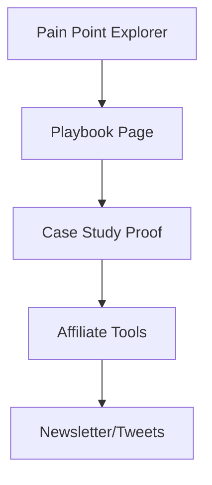

# 🧩 REALWEBWINS PHASE 3: PLAYBOOK INTEGRATION PLAN

## 🎯 Goal
Link every pain point to a corresponding **Playbook page** — a concise, actionable guide showing:
- **How others solved that pain**
- **Tools or templates used**
- **Real case studies**
- **Affiliate or product recommendations**

This turns the PainPoint Explorer into a full *Problem → Solution → Proof* loop.

---

## 🧱 Architecture Overview

| Layer | Description | Status |
|--------|--------------|--------|
| Pain Points | Problems discovered in Phase 1 | ✅ |
| Playbooks | Solutions linked to pain points | 🚧 Build in this phase |
| Cases | Proof examples (already exist) | ✅ |
| Newsletter/Tweets | Distribution channel | 🔜 Next phase |

---

## ⚙️ Database Updates

### Table: `playbooks`
Create a new table in Supabase.

| Column | Type | Description |
|---------|------|-------------|
| id | uuid | Primary key |
| title | text | Playbook title |
| slug | text | URL slug |
| description | text | Short summary |
| content | text | Full Markdown or rich text |
| category | text | Match with pain_points.category |
| niche | text | Match with pain_points.niche |
| related_pain_id | uuid | FK → pain_points.id |
| related_case_id | uuid (nullable) | FK → research_projects.id |
| tools | jsonb | Array of tool names or links |
| affiliate_links | jsonb | Array of affiliate URLs |
| created_at | timestamptz | default now() |

**Indexes**
- slug (unique)
- category, niche for filtering

**RLS Policy**
- Public read
- Service-role write

---

## 📚 File Structure

```
src/
 ├─ app/
 │   ├─ playbook/
 │   │   ├─ page.tsx              # List view (optional)
 │   │   └─ [slug]/page.tsx       # Individual playbook detail
 │   ├─ api/
 │   │   └─ playbooks/route.ts    # GET endpoint for playbook data
 │   └─ pain-points/[slug]/page.tsx
 │        └── add “Related Playbook” link
 ├─ lib/
 │   └─ playbooks/
 │       ├─ queryPlaybooks.ts
 │       ├─ getPlaybookBySlug.ts
 │       └─ types.ts
 ├─ components/
 │   └─ playbooks/
 │       ├─ PlaybookCard.tsx
 │       ├─ PlaybookContent.tsx
 │       ├─ ToolsList.tsx
 │       └─ AffiliateLinks.tsx
scripts/
 └─ seedPlaybooks.mjs
```

---

## 🧩 Components to Build

| Component | Purpose |
|------------|----------|
| `PlaybookCard.tsx` | Compact preview (title, summary, category, CTA) |
| `PlaybookContent.tsx` | Renders Markdown/HTML body |
| `ToolsList.tsx` | Lists tools + icons with external links |
| `AffiliateLinks.tsx` | Display affiliate links cleanly with disclosures |
| `RelatedPainPoint.tsx` | Shows linked pain point info |
| `RelatedCase.tsx` | Embeds proof case from `/cases` |

---

## 🌐 Routes

### `/playbook/[slug]`
- Fetch by slug via `getPlaybookBySlug()`
- Display:
  - Title + category badges
  - Description
  - Main content (Markdown → HTML)
  - “Tools used” section
  - Related pain point card (mini view)
  - Related case card (if any)
  - CTA → “Subscribe for new playbooks” or “Validate your idea”

### `/api/playbooks`
- `GET ?category=&niche=` for list
- `GET /playbooks/[slug]` for detail
- Return same structure as `pain_points` API

---

## 🧠 Data Flow



Each pain point links directly to a playbook via `related_playbook` slug or ID.

---

## 🧰 Seed Data

**File:** `data/playbooks_seed.csv`

Include ~10 playbooks:

| title | category | niche | description | related_pain_id | tools | affiliate_links |
|--------|-----------|--------|--------------|-----------------|--------|----------------|
| “Grow YouTube from 0 → 1K” | Growth | YouTubers | Strategies to get first 1K subs | (match ID) | ["TubeBuddy","Notion Tracker"] | ["https://aff.link/tubebuddy"] |
| “Etsy First Sale System” | Monetization | Etsy Sellers | How to get your first Etsy sale | (match ID) | ["Everbee","Canva"] | [...] |
| “Freelancer Pricing Playbook” | Pricing | Freelancers | How to price with confidence | (match ID) | [...] | [...] |

Seed via:
```bash
npm run seed:playbooks
```

---

## 🧩 Integration with Pain Points

- Update `/pain-points/[slug]/page.tsx`  
  Add:
  ```tsx
  {painPoint.related_playbook && (
    <Link href={`/playbook/${painPoint.related_playbook}`} className="text-blue-600 underline">
      View Playbook →
    </Link>
  )}
  ```

- In `/api/pain-points`, join playbook slug if exists.

---

## 🎨 Design Guidelines

- Consistent layout with PainPoint pages.
- Add subtle background pattern to differentiate playbooks.
- Use colored badges per category (same palette as Phase 2).
- Include “Recommended Tools” with icons (use Lucide icons or logos).
- CTA card at bottom: “Get future playbooks in your inbox” → Beehiiv/ConvertKit link.

---

## 🧪 Testing Checklist

✅ `/playbook/[slug]` loads correctly for seeded entries  
✅ Markdown content renders properly  
✅ Related pain point and case are displayed  
✅ Affiliate links open in new tab  
✅ Responsive and accessible layout  
✅ No TypeScript or lint errors  
✅ Pain point detail links navigate to correct playbook  

---

## 🧱 Success Criteria

- [ ] Supabase `playbooks` table created + seeded  
- [ ] `/playbook/[slug]` route renders correctly  
- [ ] Pain point detail pages link to related playbook  
- [ ] Design and color scheme consistent with brand  
- [ ] Markdown rendering works for playbook content  
- [ ] Ready for Phase 4: Distribution (newsletter + tweets)

---

## 🚀 Next Phase Preview
Phase 4 will focus on **distribution & automation**:
- “Top Playbooks of the Week” in newsletter exports
- Auto-generated tweet snippets linking to playbooks
- Visual cards for trending playbooks
- Optional Beehiiv or Buttondown sync
